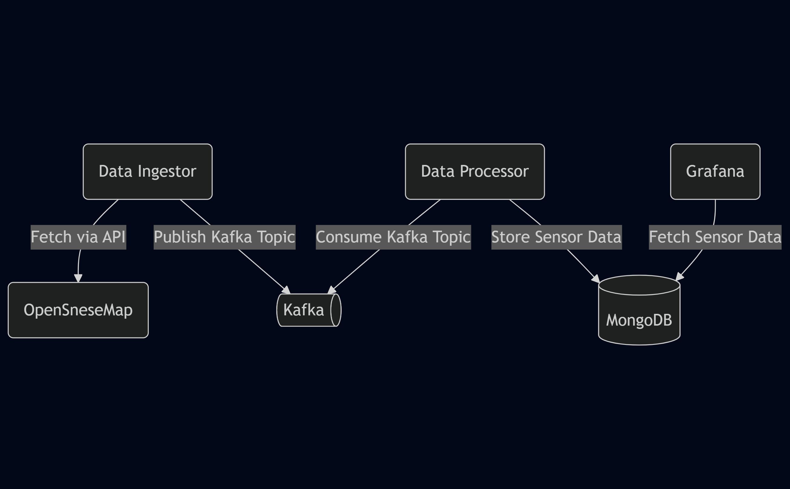
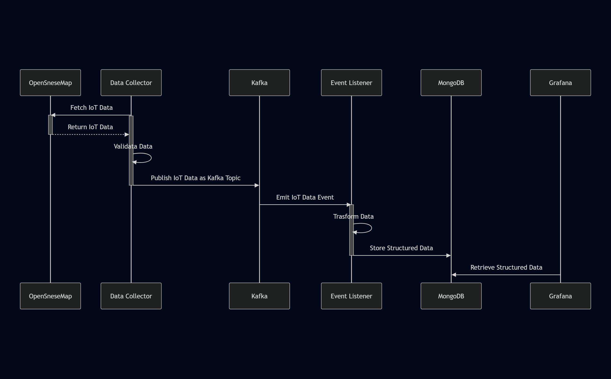

# Architecture

This document outlines the architecture of the Kafka IoT Project, focusing on how data flows between components and their responsibilities in the pipeline.

## 🧱 System Context Diagram

## 🔄 Summary of Responsibilities

| Component         | Role                                                    |
|------------------|----------------------------------------------------------|
| **Data Collector**| Fetches real-time sensor data from OpenSense and  Publishes to Kafka. Acts as the interface between external APIs and internal processing. |
| **Kafka**         | Serves as the decoupling middleware for data ingestion and distribution. Enables high-throughput, fault-tolerant message queues. |
| **Event Listener**| Subscribes to Kafka topics, processes/validates messages, and writes structured data to MongoDB. |
| **MongoDB**       | NoSQL document-based database that stores time-series and structured sensor data. Designed for scalability and flexible schema. |
| **Grafana**       | Connects to MongoDB and renders live dashboards with filters, charts, and alerts for real-time analytics. |

## Summary of Integration
| Consumer | Provider | Protocol | Description |
|-|-|-|-|
|Data Collector|OpenSense|HTTPS|Fetches IoT data from OpenSense's REST API|
|Data Collector|Kafka|Kafka Message|Publishes the IoT data from OpenSense as Kafka Topic|
|Event Listener|Kafka|Kafka Message|Consumes the Kafka Topic containing IoT data|
|Event Listener|MongoDB|MongoDB Wire|Writes IoT data to database|
|Grafana|MongoDB|MongoDB Wire|Reads IoT data from database|

## System Behaviour

> ⚠️ Sections below are pending revision

## 🧩 Component Interaction Breakdown

### 1. External Client (e.g., OpenSense API)
- Source of sensor or environmental data.
- Communicates with FastAPI via HTTP POST requests or WebSocket events.
- May push real-time streaming data or trigger batch ingestion jobs.

### 2. Data Collector
- RESTful web server handling inbound API traffic.
- Validates incoming sensor payloads using Pydantic schemas.
- Publishes validated messages to Kafka using a Kafka producer instance.
- Avoids persistence logic (i.e., never directly writes to MongoDB).

### 3. Kafka Broker
- Asynchronous message broker enabling loose coupling between components.
- Buffers high-throughput data under a specific topic (`sensor-data`).
- Ensures reliability and scalability across distributed deployments.

### 4. Kafka Consumer
- A long-running service subscribed to `sensor-data` topic.
- Consumes and deserializes incoming messages.
- Optionally performs transformation, enrichment, or validation.
- Stores structured data into MongoDB (e.g., as documents with timestamp/device metadata).

### 5. MongoDB
- Acts as the system of record for IoT data.
- Flexible schema supports a variety of sensor types.
- Enables efficient querying by indexing timestamps and identifiers.
- Integrates with Grafana through a dedicated plugin for real-time visualizations.

### 6. Grafana
- Front-end dashboard and observability tool.
- Connects to MongoDB and reads time-series metrics.
- Renders charts, graphs, tables for users to analyze sensor data.
- Dashboards can be defined as JSON and provisioned on startup.

## ✅ Implementation Notes

- **FastAPI** should only handle validation and forwarding to Kafka.
- **Kafka Consumer** should be fault-tolerant and use auto-reconnect logic.
- **MongoDB** should be secured with role-based access and TTL indexes.
- **Grafana** can use built-in alerting for notifying on anomalies.
- System is horizontally scalable and containerized via Docker.

## 📦 Deployment Tip

Use Docker Compose to orchestrate services. Each component should be isolated in a container:
- fastapi
- kafka
- zookeeper
- kafka-consumer
- mongodb
- grafana

Run `docker-compose up` to start the entire system.
